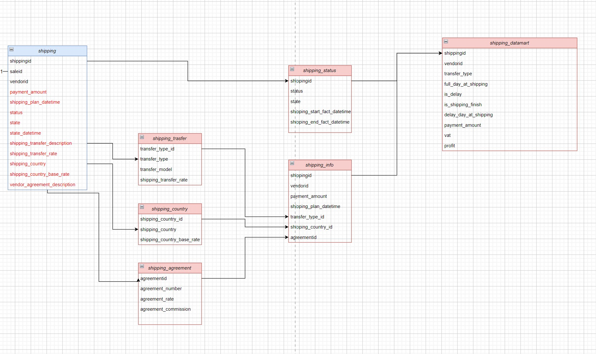

#Проект 3 спринта

##Описание

Заказ в интернет-магазине - это набор купленных товаров и их количество. Каждый заказ из набора товаров формируется в одну сущность доставки. Интернет-магаизну важно видеть что сроки доставки соблюдаются, а её стоимость соответствует тарифам. Он платит за доставку самостоятельно, и стоимость доставки меняется в зависимости от страны. На данный момент эти данные хранятся в одной таблице, shipping, где много дублирующейся и несистематизированной информации (содержится весь лог доставки от момента оформления до выдачи заказа покупателю).

**Дано**

- Таблица 'public.shipping', описание которой можно найти в файле init.sql текущей директории [здесь](./scripts/init.sql).

**Цель**

- Сделать миграцию данных в отдельные логические таблицы, а затем собрать на них витрину данных.

**Зачем**

- Это поможет оптимизировать нагрузку на хранилище. Если искать эти данные в исходной таблице, нагрузка на хранилище будет на оптимальна, придется усложнять запросы, что может привести к ошибкам.

## Описание исходных данных

Таблица 'shipping', которая представляет собой последовательность действий при доставке:

- 'shippingid' - уникальный идентификатор доставки.

- 'saleid' - уникальный идентификатор заказа. К одному заказу может привязано несколько строчек 'shippingid'.

- 'vendorid' - уникальный идентификатор вендора. К одному вендору может быть привязано множество 'saleid' и множество стран доставки.

- 'payment' - сумма платежа.

- 'shipping_plan_datetime' - плановая дата доставки.

- 'status' - статус доставки по одному 'shippingid'. Может принимать значения 'in_progress' - доставка в процессе, либо 'finished' - доставка завершена.

- 'state' - промежуточные точки заказа, которые изменяются в соответствии с обновлением информации о доставке по времени 'state_datetime':
1. 'booked' - заказано;
2. 'fulfillment' - заказ доставлен на склад отправки;
3. 'queued' - заказ в очереди на запуск доставки;
4. 'transition' - запущена доставка заказа;
5. 'pending' - заказ доставлен в пункт выдачи и ожидает получения;
6. 'received' - покупатель забрал заказ;
7. 'returned' - покупатель возвратил заказ после того, как его забрал.

- 'state_datetime' - время обновления состояния заказа.

- 'shipping_transfer_description' - строка со значениями 'transfer_type' (тип доставки, '1р' означает, что компания берет ответственность за доставку на себя, '3р' - что за доставку ответственен вендор) и 'transfer_model' (модель доставки: 'car' - машиной, 'train' - поездом, 'ship' - кораблем, 'airplane' - самолетом, 'multiple' - комбинированная доставка), записанными через :. Пример записи - '1р:car'.

- 'shipping_transfer_rate' - процент стоимости доставки для вендора в зависимости от типа и модели доставки.

- 'shipping_country' - страна доставки, учитывая описание тарифа для каждой страны.

- 'shipping_country_base_rate' - налог на доставку в страну, который вяляется процентом от стоимости 'payment_amount'.

- 'vendor_agreement_description' - строка с данными 'agreementid' (идентификатор договора), 'agreement_number' (номер договора в бухгалтерии), 'agreement_rate' (ставка налога за стоимость товара для вендора), 'agreement_commiission' (комиссия, то есть доля в платеже являющаяся доходом компании от сделки), записанными через разделитель :. Пример записи - '12:vsp-34:0.02:0.023'.

## Конечный вид модели данных:

Скрипт создания целевой модели данных можно найти [здесь](./scripts/Project_3_new_data_model.sql).
